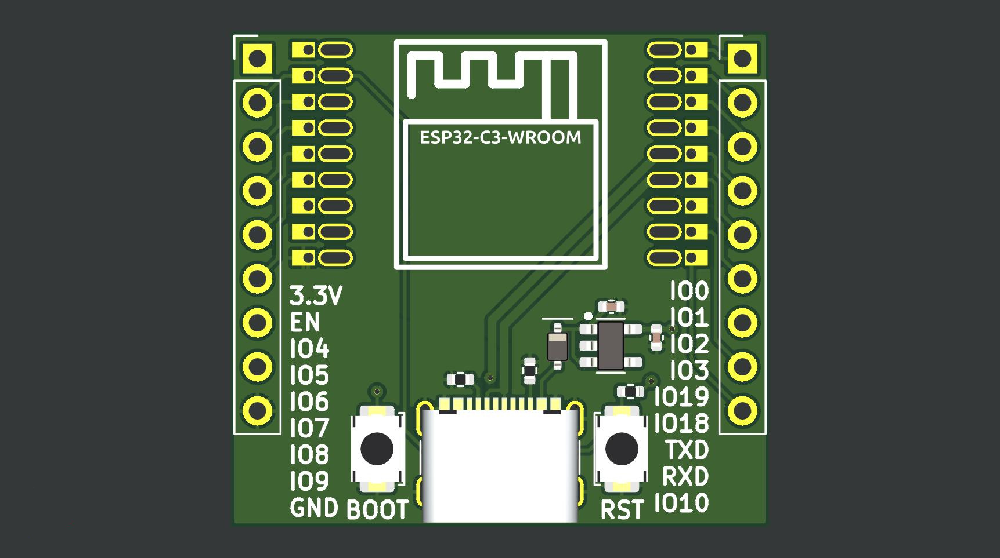

Because why not use the native USB when the module has it?

C3 for sale now:

https://lectronz.com/products/c3-flexypin-usb

https://www.tindie.com/products/ralle/esp32-c3-wroom-flexypin-adapter-with-usb-2/

